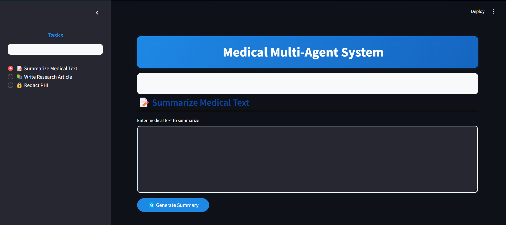

# medical_text_processing_research_redact_phi
# Medical AI Agents System 🏥

A sophisticated multi-agent AI system designed for processing medical texts using LLaMA models and Streamlit. This application provides automated summarization, research article generation, and PHI (Protected Health Information) redaction capabilities.



## 🌟 Features

- **Medical Text Summarization**: Convert lengthy medical documents into concise, accurate summaries
- **Research Article Generation**: Create structured research articles from topics and key points
- **PHI Redaction**: Automatically identify and mask sensitive healthcare information
- **Validation System**: Built-in validation agents ensure output quality and accuracy
- **User-Friendly Interface**: Clean, intuitive Streamlit-based web interface
- **Export Functionality**: Easy export of processed content

## 🛠️ Technology Stack

- **Frontend**: Streamlit
- **AI Model**: Llama-3.2:3b via Ollama
- **Backend**: Python with Asyncio
- **Logging**: Custom logging system for monitoring and debugging

## 📋 Prerequisites

- Python 3.8+
- Ollama with Llama-3.2:3b model installed
- Git

## 🚀 Installation

1. Clone the repository:
```bash
git clone https://github.com/yourusername/medical-ai-agents.git
cd medical-ai-agents
```

2. Create and activate a virtual environment:
```bash
python -m venv venv
source venv/bin/activate  # On Windows, use: venv\Scripts\activate
```

3. Install required dependencies:
```bash
pip install -r requirements.txt
```

4. Make sure Ollama is installed and the Llama model is available:
```bash
ollama pull llama3.2:3b
```

## 💻 Usage

1. Start the Streamlit application:
```bash
streamlit run app.py
```

2. Open your browser and navigate to `http://localhost:8501`

3. Choose from three main functions:
   - 📝 Summarize Medical Text
   - 📚 Write Research Article
   - 🔒 Redact PHI

## 📁 Project Structure

```
medical_ai_agents/
├── agents/
│   ├── __init__.py
│   ├── base_agent.py
│   ├── main_agents.py
│   └── validator_agents.py
├── core/
│   ├── __init__.py
│   ├── agent_manager.py
│   └── logger.py
├── utils/
│   ├── __init__.py
│   └── ollama_utils.py
├── app.py
└── requirements.txt
```

## 🤖 Agents Architecture

### Main Agents
- **Summarize Agent**: Generates medical text summaries
- **Write Article Agent**: Creates research article drafts
- **Redact Data Agent**: Masks PHI in medical data

### Validator Agents
- **Summarize Validator Agent**: Assesses summary quality
- **Refiner Agent**: Enhances article drafts
- **Redact PHI Validator Agent**: Ensures complete PHI masking

## 🔍 Validation System

Each processing task includes a validation step that:
- Provides a score out of 5
- Indicates validity status
- Offers detailed feedback
- Ensures output quality meets standards

## 📊 Logging

The system includes comprehensive logging features:
- Input/output tracking
- Error monitoring
- Validation results
- Timestamp recording

## 🛡️ Security Considerations

- PHI redaction follows HIPAA guidelines
- No sensitive data is stored permanently
- All processing happens locally
- Validation checks ensure proper data masking

## 🔄 Future Improvements

- [ ] Enhanced validation metrics
- [ ] Additional specialized agents
- [ ] User feedback integration
- [ ] Improved scalability
- [ ] Integration with medical databases
- [ ] Support for more medical document types
- [ ] Advanced data visualization features

## 🤝 Contributing

Contributions are welcome! Please feel free to submit a Pull Request. For major changes, please open an issue first to discuss what you would like to change.


## 🙏 Acknowledgments

- Thanks to The AI Forum for the original project inspiration
- Anthropic for the LLaMA model
- Streamlit team for the wonderful framework

